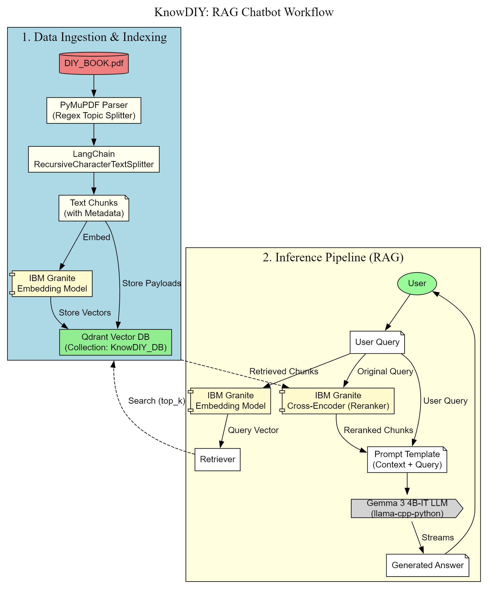

# 🧰 DIY Expert Assistant – Retrieval-Augmented Generation (RAG) Chatbot

> **An intelligent offline chatbot** that answers Do-It-Yourself (DIY) questions using a *retrieval-augmented generation* pipeline.
> It combines **IBM Granite embeddings**, **Qdrant vector search**, **Gemma-3 reasoning**, and **LangChain preprocessing** — all running locally.

## 🚀 Highlights

* 📘 Extracts and segments text intelligently from large DIY eBooks (PDF)
* 🧠 Embeds, stores, retrieves, and reranks chunks for context-aware answers
* 🤖 Generates accurate, step-by-step responses using **Gemma-3-4B-IT**
* ⚡ Runs entirely **offline** with **local Qdrant vector storage**
* 🧩 Modular — easily extendable to API, Streamlit, or production UI

## 🧩 System Architecture

Below is a **architecture diagram** showing the complete flow.

## 🧠 End-to-End Workflow

| Step                        | Description                                 |
| --------------------------- | ------------------------------------------- | 
| **1. PDF Extraction**       | Extracts structured text from DIY PDFs      | 
| **2. Topic Segmentation**   | Identifies numbered topics and sections     |
| **3. Chunking**             | Splits text into manageable semantic chunks | 
| **4. Embedding Generation** | Encodes text into dense vectors             | 
| **5. Vector Storage**       | Stores and indexes embeddings               | 
| **6. Retrieval**            | Finds top-K relevant chunks                 |
| **7. Reranking**            | Refines context relevance                   | 
| **8. Answer Generation**    | Produces final, confident response          | 

## 🧪 Working Example
[  

## 🧩 Tech Stack

| Layer               | Technology                   | Description                       |
| ------------------- | ---------------------------- | --------------------------------- |
| **Text Extraction** | 📘 PyMuPDF                   | PDF text parsing                  |
| **Chunking**        | ✂️ LangChain                 | Recursive character splitting     |
| **Embeddings**      | 🧩 IBM Granite               | 768-D text vectorization          |
| **Reranking**       | 🏗️ IBM Granite CrossEncoder | Improves retrieval quality        |
| **Vector DB**       | 🔍 Qdrant                    | Local semantic search             |
| **LLM**             | 🤖 Gemma 3-4B-IT             | Answer generation via `llama.cpp` |
| **Orchestration**   | 🧠 Python + Hugging Face     | End-to-end pipeline control       |

## 🧠 Prompt Policy

To ensure consistent and professional answers, the model prompt enforces:

* No reference to “documents” or “knowledge base”
* Direct, expert, confident tone
* Step-by-step clarity for procedural questions
* No counter-questions to the user (stateless mode)
* No hallucination — respond only if answer is known

## 📦 Exporting Vector Store

You can persist or share the knowledge base as a compressed file:[vectordb.zip](./vectordb.zip)

## 📚 Citations & Resources

1. 🧠 **Gemma 3 Model** — [Google Gemma-3-4B-IT on Hugging Face](https://huggingface.co/google/gemma-3-4b-it)
2. 🧩 **IBM Granite Embedding** — [IBM Granite Embedding English R2](https://huggingface.co/ibm-granite/granite-embedding-english-r2)
3. 🏗️ **IBM Granite Reranker** — [IBM Granite Embedding Reranker English R2](https://huggingface.co/ibm-granite/granite-embedding-reranker-english-r2)
4. 🔍 **Qdrant** — [Qdrant Vector Database Documentation](https://qdrant.tech/documentation/)
5. ⚡ **LangChain** — [LangChain Framework](https://www.langchain.com/)
6. 📘 **PyMuPDF (fitz)** — [PyMuPDF Docs](https://pymupdf.readthedocs.io/en/latest/)
7. 🐍 **llama.cpp** — [llama-cpp-python](https://github.com/abetlen/llama-cpp-python)

Would you like me to now **enhance the Graphviz diagram** with *real icons* (Hugging Face, IBM, Qdrant, Google Gemma, etc.) via image URLs — so it renders like a professional architecture poster when exported as SVG or PNG?
